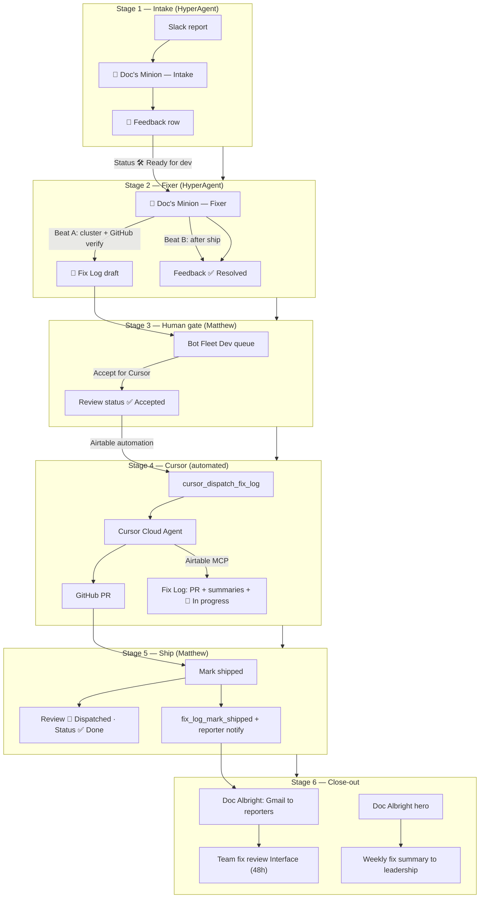

# Agentic Bug Handling Flow (Canonical)

Curated: 2026-05-24. Source: `09-bot-operations/`, `Interface_Extensions/bot-fleet/`, `.cursor/rules/bot-ops-fix-log-mcp.mdc`, fleet state docs.

## Purpose

- Give AI agents a single end-to-end map of how DS reports, triages, fixes, ships, and closes out bugs.
- Preserve stage boundaries, human gates, field ownership, and write-safety rules.
- Use this doc when routing work between HyperAgent (Slack bots), Airtable (state), and Cursor (code).

## One-Line Contract

**Intake captures → Fixer clusters → Matthew approves → Cursor implements → Matthew ships → reporters sign off → Doc summarizes.**

---

## Systems Map

| Layer | What it is | Role in bug flow |
|-------|------------|------------------|
| **Slack** | Team feedback channel (`#doc-albright-debug`) | Front door for reports |
| **HyperAgent** | Doc Intake Minion, Doc Fixer Minion, Doc Albright hero | Triage, clustering, reporter email, weekly summary |
| **Bot Operations base** | Airtable `appz1q20h5FUkSwBr` | Canonical state: Feedback + Fix Log |
| **Bot Fleet extension** | `Interface_Extensions/bot-fleet` | Matthew's Dev queue, Accept/Ship actions |
| **Cursor Cloud Agent** | `POST https://api.cursor.com/v1/agents` | Code fixes on `ds-platform` GitHub repo |
| **Airtable MCP** | Cursor write-back | PR URL + fix summaries on Fix Log row |
| **Team fix review Interface** | Airtable page `pagRQC2CDC4XwBfDA` | Reporter 48h sign-off |

---

## End-to-End Flow



---

## Stage 1 — Intake

**Agent:** `🐛 Doc's Minion — Intake` (HyperAgent)  
**Slack:** `#doc-albright-debug` (`C0B05CLECE8`)  
**Writes to:** `💬 Feedback` (`tblT92zkaeOZuzXlk`)

### What Intake does

1. Receives Slack feedback (bugs, feature requests, praise, agent wrong-answers).
2. Asks category-specific clarifying questions (max 3 per message).
3. Confirms with reporter before creating a record.
4. Creates structured **Feedback** with exact emoji single-select values.
5. Post-create read-back: patches missing pipeline fields before replying.

### Intake does NOT

- Debug or implement fixes.
- Set Fix Log fields, PR, reporter review fields, or resolution notes.
- Promise fix ETAs.

### Ready-for-dev gate at intake

Set **Status** = `🛠 Ready for dev` only when **all** of:

- Type is `🐛 Bug` or build-like `💡 Feature Request`
- **Fix surface**, **Affected product**, **Acceptance criteria** populated
- **Details** contains `### Cursor handoff`
- **🔗 Submitted By** linked to 👥 Team Members (or Status stays `🆕 New` with gap noted)

Otherwise **Status** = `🆕 New`.

### Key Feedback fields (intake-owned)

| Field | Field ID | Notes |
|-------|----------|-------|
| Title | `fldK3HCJQHzdI52Y8` | `[Product] — symptom` |
| Status | `fldbZd2Ae9NBdCN5p` | See lifecycle below |
| Fix surface | `fldEBSVUNfLyB3YWU` | e.g. `Interface extension` |
| Affected product | `fldQN1txztQoudF94` | e.g. `RM Staffing` |
| Acceptance criteria | `fldJNOe4G3l2JPeKc` | 2–5 testable bullets |
| 🔗 Submitted By | `fldzGPbV8LUV1cign` | **Required link** — enables reporter review |

**Skill:** `09-bot-operations/skills/bot-operations-feedback-intake.skill.json`  
**Setup:** `09-bot-operations/docs/doc-albright-intake.md`

---

## Stage 2 — Fixer

**Agent:** `🔧 Doc's Minion — Fixer` (HyperAgent)  
**Schedule:** Daily cron + webhook on Feedback → `🛠 Ready for dev`  
**Integrations:** Airtable (write), Slack, GitHub (`ds-platform` private repo)

### Beat A — Cluster → Fix Log draft

1. Load Feedback where **Status** = `🛠 Ready for dev` and not already linked to an active Fix Log.
2. **Cluster** related reports (same Fix surface + product, same symptom vocabulary).
3. **GitHub verify:** search repo; every path in Suggested fix must be verified or marked `unverified — tried: <query>`.
4. Create/update one **Fix Log** row per cluster with hypothesis, evidence, and Cursor handoff package.
5. Link all cluster Feedback via **Reports** and **🔗 Part of fix**.

### Beat B — Resolve after ship

When Fix Log **Review status** = `🚀 Dispatched` or **Status** = `✅ Done`:

- Set linked Feedback **Status** → `✅ Resolved`
- Append **Resolution notes** (idempotent)

Beat B runs even when Beat A finds nothing.

### Fixer does NOT

- Set Review status to `✅ Accepted` or `🚀 Dispatched`
- Set Feedback ✅ Resolved on Beat A
- Hallucinate file paths

### Fix Log fields (Fixer Beat A-owned)

| Field | Field ID | Beat A value |
|-------|----------|--------------|
| Name | `fld2sBNHBiCjNpzim` | `[Product] — [symptom] ([layer])` |
| Suggested fix | `fldHnGzrWEGW4EMLB` | Cursor package (see template in skill) |
| Reports | `fldZTVZBqJnutUQYy` | All cluster Feedback ids |
| Review status | `fldYweGQHTbCiZk4C` | `📝 Draft suggested` |
| Status (ship) | `fldiWCZ0o18Uwj2Oe` | `📋 Planned` |

**Skill:** `09-bot-operations/skills/bot-operations-fix-log-fixer.skill.json`  
**Setup:** `09-bot-operations/docs/doc-fixer-minion.md`

### Webhook triggers (Airtable → HyperAgent)

| mode | When | Action |
|------|------|--------|
| `fixer-beat-a-trigger` | Feedback → `🛠 Ready for dev` | Run Beat A + B |
| `fixer-matthew-cluster-alert` | Fix Log ≥3 Reports or all 🔴 High | Slack DM Matthew |
| `feedback-weekly-digest` | Monday 09:00 Europe/London | Weekly digest to Slack |

Details: `09-bot-operations/docs/automation-webhooks.md`

---

## Stage 3 — Human Review (Matthew)

**UI:** Bot Fleet extension (`Interface_Extensions/bot-fleet`)  
**Modes:** Operations, MH Review  
**Owner:** Matthew Hopkinson

### Dev queue (two rails)

1. **Ready for dev** — raw `💬 Feedback` rows awaiting Fixer or manual action.
2. **Fix drafts** — `🔧 Fix Log` rows in Review status: Draft / Ready / Accepted.

### Matthew's actions

| Action | Effect | Who else can trigger |
|--------|--------|---------------------|
| **Ready for Matthew** | Review status → `👀 Ready for Matthew` | Matthew |
| **Accept for Cursor** | Review status → `✅ Accepted` | Matthew only — starts Cursor dispatch |
| **Call Fixer** | Webhook → Fixer Beat A | Matthew |
| **Edit before Send to Cursor** | Inline save title, Suggested fix, summaries | Matthew |
| **I fixed this myself** | Skip Cursor; mark Done/Dispatched | Matthew |
| **Send knowledge-gap answer** | Non-code resolution; mark Done/Dispatched | Matthew |
| **Skip** | Review status → `⏭️ Skipped` | Matthew |

**Critical gate:** Only Matthew sets **Review status** = `✅ Accepted`. The Cursor dispatch automation watches this field — it does not set it.

---

## Stage 4 — Cursor Implementation

**Trigger:** Airtable automation when Fix Log **Review status** → `✅ Accepted` (and **Cursor agent URL** empty)  
**Script:** `09-bot-operations/scripts/automations/cursor_dispatch_fix_log/cursor_dispatch_fix_log.airtable.js`  
**Secret:** `CURSOR_API_KEY` in Airtable Secrets (not plain input variables)

### What the dispatch script does

1. Reads Fix Log **Suggested fix** (primary instructions) + summaries.
2. `POST https://api.cursor.com/v1/agents` with `autoCreatePR: true` on `ds-platform`.
3. Writes **Cursor agent URL** (`fldVAqdgCFwYCdSYC`) and **Cursor last run id** (`fldORYlfaRoIpQsxr`).
4. Embeds MCP write-back instructions in the agent prompt.

### What the Cursor agent does

1. Implements the fix per **Suggested fix** and repo conventions.
2. Opens a GitHub PR.
3. **MCP write-back (phase 1)** — two calls acceptable:
   - **As soon as PR exists:** set **PR** URL
   - **When ready for review:** set Quick/Detailed Fix Summary, Fix Confidence, **Status** = `🔧 In progress`

### Cursor agent must NOT (via MCP)

- Set **Status** → `✅ Done` or **Date fixed**
- Change **Review status**, **Suggested fix**, or Feedback rows

**Cursor rule:** `.cursor/rules/bot-ops-fix-log-mcp.mdc`  
**Full reference:** `09-bot-operations/docs/cursor-mcp-writeback-fix-log.md`, `09-bot-operations/docs/cursor-cloud-agent-from-fix-log.md`

### MCP write-back field map

| Field | Field ID | Cursor sets |
|-------|----------|-------------|
| PR | `fld1umX7bNNGzfekp` | Full GitHub PR URL |
| Quick Fix Summary | `fldQAqWnb7hR81n88` | 2–4 sentences (what we did) |
| Detailed Fix Summary | `fld148sikQNP3fZIY` | Files, approach, verify steps |
| Fix Confidence | `fldNBr9n5kof40mEp` | `High` / `Medium` / `Low` |
| Status (ship) | `fldiWCZ0o18Uwj2Oe` | `🔧 In progress` only |

### PR merge-ready loop (optional)

After Cursor opens a PR, a separate Cursor session may **babysit** the PR: resolve merge conflicts, triage Bugbot comments, fix CI — without changing CI checks just to pass. See Cursor skill `babysit`.

---

## Stage 5 — Ship

**Owner:** Matthew (human ship step — not MCP, not Cursor)

### Mark shipped checklist (Bot Fleet UI)

1. PR merged
2. `block release` run if Interface Extension changed
3. Live in Airtable verified

### Mark shipped writes

| Field | Field ID | Value |
|-------|----------|-------|
| Review status | `fldYweGQHTbCiZk4C` | `🚀 Dispatched` |
| Dispatched at | `fldDvkidqerdRg4w9` | Timestamp (starts 48h reporter window) |
| Status (ship) | `fldiWCZ0o18Uwj2Oe` | `✅ Done` |
| Date fixed | `fldSX3kMNgMoeHpuo` | Today (`YYYY-MM-DD`) |

**Safety-net automation:** `fix_log_mark_shipped.airtable.js` when Review status → `🚀 Dispatched` (skips if already Done).

### Post-ship automations

1. **fix_log_mark_shipped** — ensures Done + Date fixed + Dispatched at
2. **fix_log_reporter_review_notify** — POST HyperAgent webhook (`mode: fix-log-reporter-review`) → Doc drafts Gmail to all linked reporters

---

## Stage 6 — Reporter Close-out

**Interface:** Team fix review (`pagRQC2CDC4XwBfDA`) — Bot Fleet mode **Team fix review**  
**Window:** 48 hours from **Dispatched at**

Each reporter signs off on **their own** linked Feedback row:

| Field | Field ID | Values |
|-------|----------|--------|
| Reporter fix review | `fldnAZ1Zxva3B8qP0` | `✅ Looking Good!` / `👎 Bug Persisted` |
| Reporter fix notes | `fldBE6JZSURs9j0Kz` | What they tried |
| Reporter reviewed at | `flduzQKupfUcy2we1` | Timestamp |

**Doc Fixer Beat B** sets Feedback **Status** → `✅ Resolved` on ship; reporter review is separate sign-off.

Details: `09-bot-operations/docs/team-fix-review-workflow.md`

---

## Stage 7 — Fleet Reporting

**Agent:** `🐛 Doc Albright — Debug` (hero, `recJhZgo80neGeMPJ`)  
**Cadence:** Weekly summary to DS leadership + 6-hourly health checks

- Posts weekly fix summary with interface links.
- Does not collapse intake/fixer boundaries into a monolithic debug flow.
- May handle reporter-review Gmail drafts when webhook fires.

Fleet state: `docs/context/bot-fleet-state.md`  
Minion workflow baseline: `docs/context/doc-albright-minion-debug-workflow-2026-05.md`

---

## Status Lifecycles

### 💬 Feedback Status

```
🆕 New → 🛠 Ready for dev → 🔧 In Progress → ✅ Resolved
                                              → ❌ Won't Fix
         👀 Acknowledged (manual ops)
```

| Status | Typical setter |
|--------|----------------|
| `🆕 New` | Intake (incomplete pipeline) |
| `🛠 Ready for dev` | Intake (complete pipeline) |
| `✅ Resolved` | Fixer Beat B after ship |
| `❌ Won't Fix` | Matthew / ops |

### 🔧 Fix Log Review status (human + automation gate)

```
📝 Draft suggested → 👀 Ready for Matthew → ✅ Accepted → 🚀 Dispatched
                                            → ⏭️ Skipped
```

| Review status | Setter |
|---------------|--------|
| `📝 Draft suggested` | Fixer Beat A |
| `👀 Ready for Matthew` | Matthew |
| `✅ Accepted` | Matthew — triggers Cursor dispatch |
| `🚀 Dispatched` | Matthew Mark shipped |
| `⏭️ Skipped` | Matthew |

### 🔧 Fix Log Status (ship tracking)

```
📋 Planned → 🔧 In progress → ✅ Done
                             → ❌ Won't do
```

| Status | Setter |
|--------|--------|
| `📋 Planned` | Fixer Beat A |
| `🔧 In progress` | Cursor MCP |
| `✅ Done` | Matthew Mark shipped |

---

## Agent Roles Summary

| Agent | Model (baseline) | Scope | Must not |
|-------|------------------|-------|----------|
| **Doc Intake Minion** | claude-sonnet-4-6, low | Slack triage → Feedback | Implement fixes |
| **Doc Fixer Minion** | claude-opus-4-6, high | Cluster → Fix Log; resolve Feedback on ship | Accept/Dispatch; set PR |
| **Doc Albright (hero)** | claude-opus-4-7, max | Weekly summary, deep diagnosis, reporter email | Replace minion stages |
| **Cursor Cloud Agent** | composer-2 (configurable) | Code + PR + MCP write-back | Mark Done / Date fixed |
| **Matthew** | Human | Accept, ship, skip, manual fixes | — |

Delegation model: `docs/context/ds-build-fix-bot-operating-model-2026-04.md`

---

## Non-Negotiable Guardrails

1. **Keep stages separate** — do not collapse intake + fixer + Cursor into one agent.
2. **Human gate before code** — Cursor runs only after Matthew sets `✅ Accepted`.
3. **Human gate before Done** — only Matthew (Mark shipped) sets `✅ Done` and **Date fixed**.
4. **Exact emoji strings** — single-select values must match Airtable byte-for-byte.
5. **Use field IDs for MCP** — never guess; see `09-bot-operations/docs/schema-field-ids.md`.
6. **GitHub paths verified** — Fixer must verify or mark unverified; Cursor should not invent paths.
7. **Submitted By link required** — reporter review depends on 👥 Team Members link.
8. **Repo is canonical** — Bot Operations base is state; `ds-platform` is code truth.

---

## Repo File Index

| Path | Purpose |
|------|---------|
| `09-bot-operations/README.md` | Bot Ops hub |
| `09-bot-operations/skills/bot-operations-feedback-intake.skill.json` | Intake contract |
| `09-bot-operations/skills/bot-operations-fix-log-fixer.skill.json` | Fixer Beat A/B contract |
| `09-bot-operations/docs/cursor-cloud-agent-from-fix-log.md` | Cursor dispatch setup |
| `09-bot-operations/docs/cursor-mcp-writeback-fix-log.md` | MCP field map |
| `09-bot-operations/docs/automation-webhooks.md` | Webhook modes |
| `09-bot-operations/docs/team-fix-review-workflow.md` | Reporter 48h sign-off |
| `09-bot-operations/scripts/automations/cursor_dispatch_fix_log/` | Cursor API dispatch |
| `09-bot-operations/scripts/automations/fix_log_mark_shipped/` | Ship close-out |
| `09-bot-operations/scripts/automations/fix_log_reporter_review_notify/` | Reporter email webhook |
| `09-bot-operations/scripts/automations/feedback_ready_for_dev_trigger_fixer/` | Ready → Fixer webhook |
| `.cursor/rules/bot-ops-fix-log-mcp.mdc` | Cursor MCP write-back rule |
| `Interface_Extensions/bot-fleet/` | Dev queue, Accept, Mark shipped UI |
| `docs/context/bot-fleet-state.md` | Fleet roster and channels |
| `docs/context/hyperagent-cursor-handoff.md` | Cross-tool handoff template |

---

## When AI Should Route Where

| Task type | Route to |
|-----------|----------|
| Slack bug report from team | HyperAgent Doc Intake Minion |
| Clustering / Fix Log draft | HyperAgent Doc Fixer Minion |
| Code change on `ds-platform` | Cursor (after Accept) |
| Airtable schema/automation fix | Cursor + Airtable MCP |
| Accept / ship / skip decision | Matthew via Bot Fleet |
| PR merge conflicts / CI / Bugbot | Cursor babysit skill |
| Day-to-day ops, fleet coordination | HyperAgent |
| Canonical doc updates | DS Platform Documentarian |

---

## Cross-References

- Doc minion workflow (shorter): `docs/context/doc-albright-minion-debug-workflow-2026-05.md`
- Build/fix delegation: `docs/context/ds-build-fix-bot-operating-model-2026-04.md`
- Bot Ops base baseline: `docs/context/bot-operations-architecture-2026-04.md`
- Fleet current state: `docs/context/bot-fleet-state.md`
- Trinity pattern (similar human-gate model): `docs/context/trinity-orchestration-pattern-2026-04.md`
- Context ops: `docs/context/context-operations-playbook.md`
