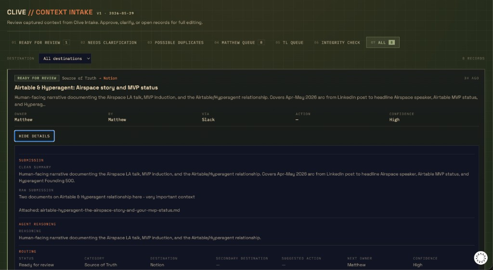
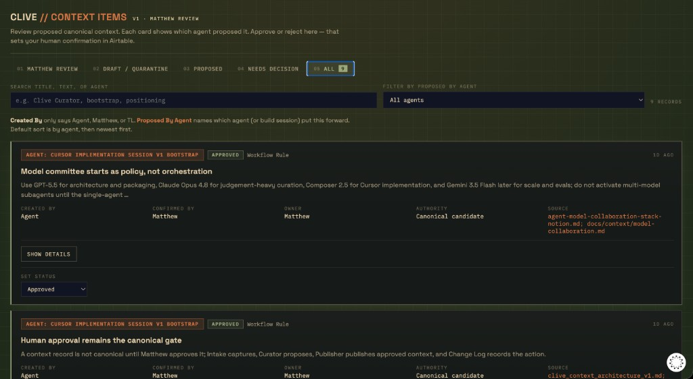
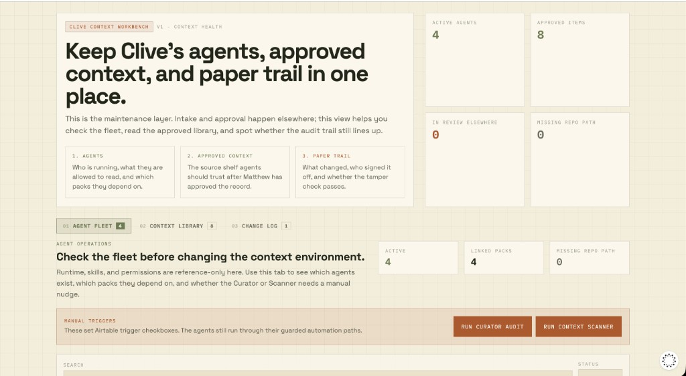

# Clive Context Architecture V2

**Status:** V2 proposal. Adversarial review of V1 plus the corrective design.
**Audience:** Matthew, TL, and AI assistants.
**Last updated:** 31 May 2026
**Supersedes:** the enforcement assumptions in `clive_context_architecture_v1.md`. V1 tables, scripts, and Curator stay; V2 changes how trust and approval are enforced.

---

## 1. Why V2 Exists

V1 built the right shape: five governed tables, narrow scripts, a Curator that
only creates `Proposed` records, and an append-only Change Log by convention.

V1 got one thing wrong, and it is the most important thing. The AstraJax thesis
is "humans keep judgement, agents take the sludge, always an audit trail."
In V1 the human approval gate is a value the agent fills in itself. That is not
a gate. It is a confident chaos machine with a polite comment above it.

V2 fixes enforcement, provenance, and traceability without expanding scope.

---

## 2. Red-Team Findings (V1)

### Critical

**C1. The approval gate is agent-forgeable.**
`create_context_item.py` trusts `matthew_confirmation: true` from the JSON
payload. `update_context_item_status.py` trusts `--confirmed-by Matthew` from
the command line. Both values are supplied by whatever runs the script, which is
the agent. An agent can self-approve, self-publish, and self-deprecate by
passing the right string. The "human in the loop" is a boolean.

**C2. The V1 bootstrap items were AI-proposed and AI-confirmed.**
The eight `Proposed` Context Items currently in the base were created by the
implementation agent with `matthew_confirmation: true` set by the agent. Matthew
never saw or confirmed them. They are sitting one forged status update away from
"Approved" and they already look like curated human-reviewed records. This is
C1 happening in production, on day one.

### High

**H1. One PAT, full base write. Script guardrails are bypassable.**
Every script uses the same `AIRTABLE_API_KEY` with `data.records:write` on the
whole base. The "write permissions" table in
`hyperagent/context_architecture_schema_v1.json` is documentation, not
enforcement. Any agent with `execute-script` can ignore the narrow scripts and
POST/PATCH/DELETE any table directly, including setting `Approved` on Context
Items or rewriting Change Log rows.

**H2. "Append-only" Change Log is not append-only.**
`append_change_log.py` only creates rows, but the token can PATCH and DELETE
them. The audit trail can be edited or erased by the same credential that writes
it. An audit trail you can silently rewrite is not an audit trail.

**H3. Context Items have no real source links.**
The bootstrap items cite sources as free text in `Source Notes`. None populate
the `Source Intake` link field. The acceptance criterion "Context Items always
cite source records" is only cosmetically met. There is no enforced, clickable
chain from a canonical claim back to the intake evidence, which is exactly the
traceability the architecture promised.

### Medium

**M1. No dedup or idempotency.** `create_context_item.py` does not check for an
existing item with the same title. The bootstrap only avoided duplicates because
the agent hand-maintained an `existing` set in a throwaway shell script. Re-runs
will duplicate canonical context.

**M2. Select-option fragility.** Scripts send select values with no `typecast`
and no pre-validation against the allowed values captured in the schema. The
bootstrap crashed on `Applies To = "Slack"`. Failures are late (Airtable 422)
instead of caught before the call.

**M3. Doc drift not closed.** V1 added a new architecture doc but did not mark
`clive_intake_v1.md` and `clive_intake_first_draft_v0_2.md` as superseded. The
contradictory "Curator/Slack deferred" statements still read as live.

**M4. Agent Environments not linked to Context Packs.** Both were seeded, but the
registry-to-pack links the plan called for were never created, so the registry
cannot answer "which packs does this agent depend on."

**M5. Secret handling.** The token is read from `mcp.json` and exported inline on
the command line in every run, which writes it into shell history and the
terminal capture files. The credential is more exposed than it needs to be.

### Low

**L1. Weak validation.** `validate_context_architecture_v1.py` checks record
counts, not content. It never asserts that each Context Item carries a source
link or source note, so H3 passed validation unnoticed.

**L2. Curator can still edit files.** The Cursor agent is `readonly: false`.
Only the skill prose stops it editing the repo while "acting as Curator." That
is another honor-system control, not an enforced one.

**L3. No reversal path.** There is no script to quarantine or roll back records
created in error, which is needed immediately given C2.

---

## 3. V2 Design Principles

1. A gate is only real if the agent cannot satisfy it alone.
2. Provenance is explicit: every record records who or what created it and how a
   human confirmed it.
3. Traceability is enforced by links, not prose.
4. Least privilege on credentials, not just on scripts.
5. The audit trail must be hard to rewrite.
6. Fail early and locally, not late at the API.

---

## 4. Corrective Changes

### 4.1 Replace the forged approval gate (fixes C1, C2)

Stop treating approval as something an agent asserts. Two-part change:

- Agents may only ever write `Status = Proposed`. No script run by an agent may
  set `Approved`, `Published`, or `Deprecated`. Remove the `--confirmed-by`
  approval path from any agent-invokable script.
- Human transitions happen in Airtable directly (a human editing the record or
  an Approve button in the Interface Extension), or through a script gated by a
  secret only Matthew holds (an approver PAT or passphrase in Matthew's env, not
  in `mcp.json`, not available to agents).

Add provenance fields to `Context Items`:

- `Created By` (Agent / Matthew / TL)
- `Proposed By Agent` (text: which agent + run)
- `Confirmed By Human` (Matthew / TL / empty)
- `Confirmation Method` (Airtable edit / Interface button / approver script)

An item is canonical only when `Status = Approved` AND `Confirmed By Human` is
set by a human-only path. Agent-set confirmation is structurally impossible
because agents cannot write those fields.

### 4.2 Quarantine the V1 bootstrap items (fixes C2 now)

The eight existing `Proposed` items must be reset to `Draft` (or a new
`Agent proposed` status) and flagged `Created By = Agent`,
`Confirmed By Human = empty`. They re-enter the queue as genuine proposals for
Matthew to review. This is the first V2 action and it touches live data, so it
needs Matthew's go-ahead.

### 4.3 Split credentials (fixes H1, H2, M5)

- A read-only PAT for all read scripts and for Curator's normal operation.
- A write PAT scoped as tightly as Airtable allows, used only by the
  create-`Proposed` path.
- An approver credential held only by Matthew for status promotion.
- Stop exporting tokens inline. Load from a gitignored `.env` or the OS keychain
  so credentials never hit shell history or terminal capture files.

This makes H1's bypass require a credential the agent does not have.

### 4.4 Make Change Log tamper-evident (fixes H2)

- Curator and Publisher never get update/delete on Change Log.
- Each entry carries a `Prev Hash` and `Entry Hash` (hash of the entry plus the
  previous hash) so any later edit or deletion breaks the chain and is
  detectable.
- Optionally mirror entries to an append-only file under `docs/context/audit/`
  committed to GitHub, so the audit trail has a second home outside Airtable.

### 4.5 Enforce traceability (fixes H3, L1)

- `create_context_item.py` requires at least one of `source_intake_ids` (real
  links) or, for bootstrap-only items, an explicit `source_doc` plus a
  `bootstrap: true` flag.
- Validation asserts every Context Item has a populated `Source Intake` link or a
  recorded bootstrap source. Counts are not enough.

### 4.6 Idempotency and validation (fixes M1, M2, L1)

- `create_context_item.py` checks for an existing item with the same `Title`
  (and optionally a content hash) and refuses or updates instead of duplicating.
- Scripts validate every select value against
  `context_architecture_schema_v1.json` allowed values before the API call, and
  pass `typecast` only where deliberately allowed.
- The validation script gains content assertions: provenance present, source
  link present, no agent-confirmed approvals, Change Log hash chain intact.

### 4.7 Close doc drift and registry links (fixes M3, M4)

- Add a "Superseded by Context Architecture V1/V2" banner to `clive_intake_v1.md`
  and `clive_intake_first_draft_v0_2.md`.
- Link each `Agent Environments` record to the `Context Packs` it depends on.

### 4.8 Constrain Curator in Cursor (fixes L2)

- Keep Curator's normal model on the read-only PAT.
- The skill keeps the prose ban on file edits, but the real control is that the
  Curator credential cannot approve or publish, so a slip cannot canonicalise
  anything.

---

## 5. V2 Status Lifecycle

```text
Agent proposed (Draft)
  -> Proposed            (human acknowledges it is worth deciding)
  -> Needs decision
  -> Approved            (human-only path; sets Confirmed By Human)
  -> Published           (Publisher, approved only, writes Change Log)
  -> Deprecated
```

Agent-writable statuses: `Agent proposed` / `Proposed` only.
Human-only statuses: `Approved`, `Rejected`, `Deprecated`.
Publisher-only status: `Published`, always with a Change Log entry.

---

## 6. Interface Proof

V2 is not only tables, scripts, and credentials. It also has three human-facing
surfaces that make the trust model visible:

| Surface | Role in V2 | What it proves |
|--------|------------|----------------|
| **Context Intake** | Captures raw submissions and routes them into review | Agents propose; humans see the raw evidence before anything becomes canonical |
| **Context Items** | Matthew's review queue for proposed canonical context | `Created By`, `Proposed By Agent`, and `Confirmed By Human` are visible at decision time |
| **Context Workbench** | Operating cockpit for fleet, approved library, and paper trail | The maintenance layer stays readable after approval — agents, approved context, audit trail in one place |

These screens are **not** the source of trust. They are where the trust model
becomes visible to Matthew. Enforcement still lives in credentials, field
permissions, narrow scripts, and the tamper-evident Change Log (sections 4 and
7). The interfaces make the gate legible; they do not replace it.

Screenshots from production Airtable Interface Extensions (May 2026) are in
**Appendix A**.

---

## 7. New Acceptance Tests

- AT-1: An agent cannot set `Approved`, `Published`, or `Deprecated` with any
  available script or credential.
- AT-2: Approval requires the approver credential or an Airtable human edit; a
  forged `--confirmed-by` no longer exists as a path.
- AT-3: Every Context Item has a `Source Intake` link or a recorded bootstrap
  source.
- AT-4: Re-running a create does not duplicate an existing item.
- AT-5: Editing or deleting a Change Log row breaks the hash chain and is
  detected by validation.
- AT-6: Every Context Item records `Created By` and, if Approved,
  `Confirmed By Human`.
- AT-7: The eight V1 bootstrap items are not `Approved` and are flagged
  `Created By = Agent`.

---

## 8. Migration Order

1. Quarantine the eight V1 bootstrap items (needs Matthew go-ahead; touches live
   data).
2. Add provenance and hash fields to `Context Items` and `Change Log`.
3. Split credentials; move tokens out of inline export.
4. Patch `create_context_item.py`, `update_context_item_status.py`,
   `append_change_log.py`, and the common helper for validation, idempotency,
   and hashing.
5. Remove the agent-invokable approval path; document the human approval path.
6. Strengthen the validation script with content and chain checks.
7. Close doc drift and link Agent Environments to Context Packs.
8. Re-run validation; only then call V2 operational.

---

## 9. What V2 Still Does Not Build

- Publisher automation beyond Change Log writing.
- Scanner.
- Multi-model subagent orchestration.
- Any agent-side approval or publishing authority.

V2 is not bigger than V1. It is the same system with the trust model made real.

---

## Appendix A — Interface screenshots (demo material)

Production Interface Extensions in the AstraJax base (`appYv601Oq7fKTCj0`),
captured 31 May 2026. Use these when explaining the architecture to Matthew, TL,
or external readers who need to see the operating shape, not just the schema.

### A.1 Context Intake — review queue

Clive Intake captures submissions (e.g. from Slack), shows clean summary vs raw
evidence, agent reasoning, and routing (status, category, destination, next
owner). This is the front door: nothing is canonical until it passes human
review downstream.



### A.2 Context Items — Matthew review

Proposed canonical context with explicit provenance: which agent proposed each
item, `Created By`, and human confirmation fields. Matthew approves or rejects
here; that sets the human sign-off in Airtable.



### A.3 Context Workbench — context health

The maintenance layer: active agents, approved context library, change log, and
manual triggers for Curator and Scanner. Intake and approval happen elsewhere;
this is where Matthew checks fleet health and the approved shelf agents rely on.


