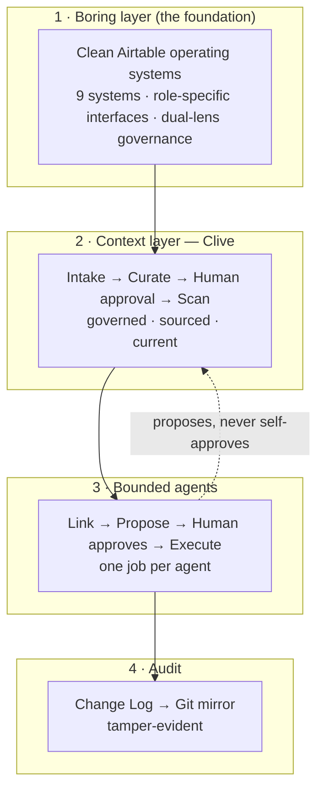
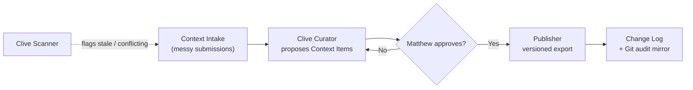
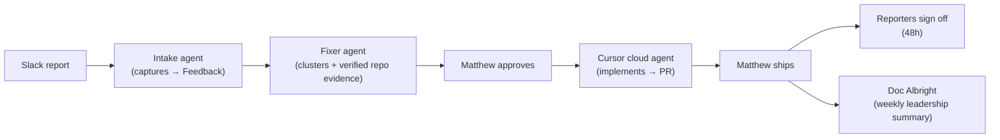
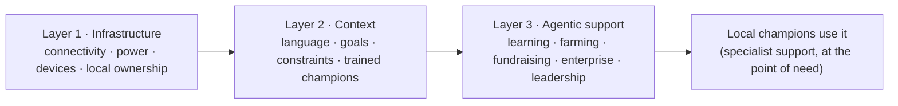

# Founding 500 — Q2 Attachment Pack

**For:** "Show us what you've been working on" (the upload + "walk us through" fields).
**Owner:** Matthew. **Date:** 31 May 2026.
**Companion to:** `founding-500-application-v2.md`.

How to use this:
- **Live links** need no upload — put them in the answer text; reviewers can open them.
- **Generated diagrams** (below) are the "to be made" assets. They render in any Markdown preview (Cursor, GitHub). To get an image file, paste the Mermaid block into <https://mermaid.live> and export PNG/SVG, or screenshot the preview. Or ask me to export PNGs.
- **Capture & redact** items are screenshots you take. Never show real team-member names, customer data, base IDs, or Slack IDs — use the illustrative/redacted views noted.

Guiding rule for every asset: show the *pattern* (bounded agents, human approval, audit), not confidential Butternut data.

---

## A. AstraJax — upload set

### A1 · Live product (links, no upload)

Lead with these in the text; they are public and zero-redaction:

- **astrajax.com** — positioning, the Clive product, the method, the offer ladder.
- **astrajax.com — Ask Clive** — a governed agent that answers only from approved AstraJax context. *Caption:* "Our own product, in public: ask it anything — it answers only from human-approved context."
- **astrajax.com — agent-fleet video** — production fleet loop. *Caption:* "The Bot Fleet from production. The product is the proof."
- **astrajax.com/journey** — the three-act build story. *Caption:* "Actor → architect: how a non-technical operator built an AI-ready operating system, boring layer first."

### A2 · System map one-pager (GENERATED — export to PNG/PDF)

*Caption:* "The AstraJax pattern: clean foundation → governed context (Clive) → bounded agents that propose → human approval → execute → tamper-evident audit."

### A3 · Clive context OS (GENERATED — export to PNG/PDF)

*Caption:* "AstraJax runs on its own product. Context is agent-proposed and human-approved before it is canonical — a knowledge layer agents can trust."

### A4 · Agentic bug-handling flow (GENERATED — export to PNG/PDF)

*Caption:* "Domain experts own the improvement loop. A Slack report becomes shipped code through bounded agents with a human gate before code and before done."

### A5 · Capture & redact (screenshots)

| Shot | What it shows | Redaction |
|---|---|---|
| AstraJax context base | Context Items with `Created By = Agent`, `Confirmed By Human = Matthew`, `Approved` | Own data — fine as-is |
| Trinity accept/decline step | Human-approval moment (old → new, accept/decline) | Use illustrative/blurred record values |
| Clive answering in-interface | In-app support agent teaching, not just answering | Blur any names |
| Doc Albright weekly report | Feedback-to-code loop output | Redact team names |
| Prompt-coaching DM | "How you asked" coaching + before/after rewrite | Redact recipient name |
| Training hub + leaderboard | Gamified adoption (courses, quiz/exam, leaderboard) | Redact names; public map page is fine |
| Hyperagent Command Center | Fleet health, cost, schedules | Own workspace — fine |

### A6 · External validation (links/clips)

- Airspace LA talk recording (full or a 60–90s cut). *Caption:* "Headline speaker at Airtable's flagship summit on what a Hyperagent power user looks like in the wild."
- Airtable sit-down interview edit — **confirm with Austin before sharing.**

---

## B. Seeds of Promise — upload set

### B1 · Live pilot page (link, no upload)

- **astrajax.com/seeds-of-promise** — the three-layer model, the Links/Sam route in, the October 2025 visit. *Caption:* "Turn access into agency: connect the centre, capture the context, then give local leaders narrow agents."

### B2 · Seeds three-layer map (GENERATED — export to PNG/PDF)

*Caption:* "Same method, different foundation. Build infrastructure, codify local context, then deploy narrow, context-aware agents — humans keep judgement."

### B3 · On-the-ground proof (photos — permission)

| Shot | What it shows | Note |
|---|---|---|
| Malawi visit / coaching session | Real relationship, October 2025 | Permission the photos before upload |
| Existing computer centre | Ready for the infrastructure layer | Confirm OK to share |

---

## C. Upload checklist (what to actually attach)

Aim for ~5–7 strong assets per application. Suggested filenames:

**AstraJax**
- [ ] `astrajax-system-map.png` (A2) — *ready once exported*
- [ ] `clive-context-os.png` (A3) — *ready once exported*
- [ ] `bug-handling-flow.png` (A4) — *ready once exported*
- [ ] `astrajax-context-base.png` (A5) — *capture, own data*
- [ ] `trinity-approval.png` (A5) — *capture + redact*
- [ ] `training-leaderboard.png` (A5) — *capture + redact*
- [ ] (text field) links to astrajax.com, Ask Clive, /journey, Airspace talk

**Seeds** — *link is the minimum; both files below are optional*
- [ ] (text field) link to astrajax.com/seeds-of-promise — **this alone is sufficient**
- [ ] `seeds-three-layers.png` (B2) — *optional, only if exported*
- [ ] `seeds-malawi-visit.png` (B3) — *optional, only with Links / Sam permission*

---

## D. "Walk us through" text

The walkthrough narrative already exists as **Q3** in `founding-500-application-v2.md` (one for AstraJax, one for Seeds). Paste that into the form's "Walk us through what you're showing" field; use the per-asset captions above as the picture-by-picture version if a reviewer wants detail.
